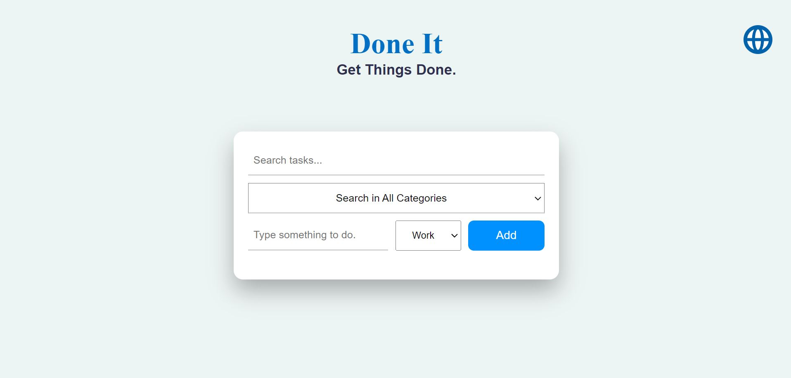

# Done It

https://alihaydarsucu.github.io/DoneIt.github.io/#

Done It is a task management application designed to help users easily plan and track their tasks. With a simple interface, you can add, edit, and categorize tasks into work, personal, or other categories. 

"Done It" supports five different languages, allowing users to manage their tasks in their preferred language. The app is helpful for organizing tasks efficiently.

  
## Features

- Adding new tasks.
- Editing and deleting existing tasks.
- Selecting and filtering categories.
- Searching between tasks.
- Changing the language of the page. (5 language is ready until today.)

## Instructions and Examples

### General View

### Usage Example

Here you see an example with 3 tasks added to "Done It".

### The Search Bar

When you type something in the search bar, it searches for it among the existing tasks and the results are sorted from top to bottom.

### The Category Search

Category search allows you to sort the tasks you have added according to the categories you have added.

### Language Section and Error Message

When you try to add a task without typing anything, you get an error message that appears on the screen and warns you for two seconds. 
Also all elements on the page support 5 different languages.
Here are the supported languages;
- English
- Turkish
- Arabic
- Russian
- Uzbek

  
## Technologies Used

**HTML ,CSS , and JavaScript**

